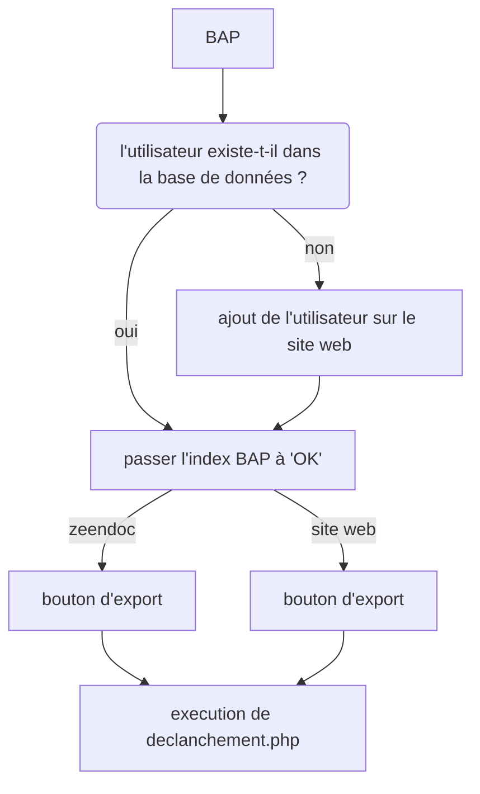
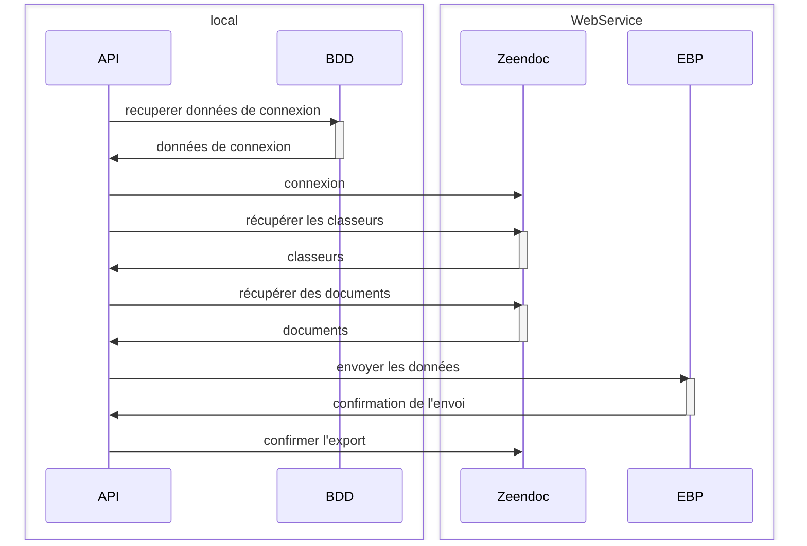

# exportBAP
export de BAP de Zeendoc vers ebp

## schéma d'utilisation


<br>

## diagramme d'utilisation




## installation

### prérequis

- serveur web (apache)
```bash
sudo apt install apache2
```

- php
```bash
sudo apt install php
```

- phpmyadmin
```bash
sudo apt install phpmyadmin
```

- mysql
```bash
sudo apt install mysql-server
```

- git
```bash
sudo apt install git
```

### installation

- cloner le projet dans le dossier /var/www/html
```bash
git clone https://github.com/Mhivelin/exportBAPDELTIC.git
```
  - si github n'est pas installé :
   ```bash
   sudo apt install git
   ```


- créer la base de données
```bash
sudo service mariadb start
#########pas encore fait #########
# mysql -u root -p < exportBAPDELTIC/sql/creation.sql 

```

- demarrer le serveur web
```bash
sudo service apache2 start
```

- pour accéder au site web
```bash
http://localhost/exportBAPDELTIC/site_web/index.php
```


## site web

### pages :

#### index.php

> permet de consulter/ajouter les comptes lié a l'api


a faire : lien requete export/ classeur

## base de données

### tables :

#### clients

| colonne      | type         | description                  |
| ------------ | ------------ | ---------------------------- |
| id_client    | TINYINT      | identifiant du client        |
| url_client   | VARCHAR(255) | url du client                |
| login        | VARCHAR(50)  | login du client              |
| mot_de_passe | VARCHAR(50)  | mot de passe du client       |
| logiciel     | VARCHAR(50)  | logiciel comptable du client |


### sql

#### clients

```sql
CREATE TABLE CLIENT(
   id_client TINYINT,
   url_client VARCHAR(255) NOT NULL,
   login VARCHAR(50),
   mot_de_passe VARCHAR(50),
   PRIMARY KEY(id_client)
);
```

#### ajout de logiciel dans la table clients

```sql
ALTER TABLE CLIENT ADD logiciel VARCHAR(50);
```


### requêtes

| requête        | description                                                                                |
| -------------- | ------------------------------------------------------------------------------------------ |
| connect.php    | permet de se connecter a la base de données                                                |
| **insert.php** | permet d'ajouter un client a la base de données en verifiant si il est valide dans Zeendoc |
| suppr.php      | permet de supprimer un client de la base de données                                        |


## ajout d'un client via le site web

| champ        | description                    |
| ------------ | ------------------------------ |
| url          | url Zeendoc du client          |
| login        | login Zeendoc du client        |
| mot de passe | mot de passe Zeendoc du client |


| champ automatique | description                                                                 |
| ----------------- | --------------------------------------------------------------------------- |
| id_classeur       | identifiant du classeur (tout les classeurs avec un index BAP sont ajoutés) |
| index_BAP         | id de l'index BAP (custom_XX)                                               |


## programme
### fonctionnement
- récupère les données de connexion de la base de données
- récupère les données des classeurs de Zeendoc
- *envoie les données a ebp*
- confirme l'export sur Zeendoc

### classes
#### Zeendoc
> permet de se connecter au webservices de Zeendoc, de récupérer les données des classeurs et de les modifier

##### attributs
| attribut         | type        | visibilité | description               |
| ---------------- | ----------- | ---------- | ------------------------- |
| wsdl             | string      | private    | url du wsdl de Zeendoc    |
| service_location | string      | private    | url du service de Zeendoc |
| service_uri      | string      | private    | url du service de Zeendoc |
| client           | object SOAP | private    | client SOAP               |

##### méthodes (seulement les méthodes utiles)
| méthode        | visibilité | description                                                               | arguments                        | exemple d'arguments     |
| -------------- | ---------- | ------------------------------------------------------------------------- | -------------------------------- | ----------------------- |
| __construct()  | public     | constructeur de la classe intialisant                                     | string $UrlClient                | deltic_demo             |
| connect()      | public     | permet de se connecter au client SOAP                                     | string $userLogin, $userPassword | deltic_demo, motdepasse |
| getDocument()  | private    | permet de récupérer les documents selon les paramètres                    | $collId, $resId, $Wanted_Columns |                         |
| getRights()    | private    | permet de récupérer les droits utilisateur                                |                                  |                         |
| getClassList() | public     | permet de récupérer la liste des classeurs disponibles pour l'utilisateur |                                  |                         |
| getIndexBAP()  | public     | permet de récupérer la liste des classeurs avec un index BAP et leur id   |                                  |                         |
| getNbBAPDoc()  | public     | permet de récupérer le nombre de documents dans bon a payer               | $collId, $indexCustom            | coll_XX, custom_XX      |
| searchDoc()    | private    | permet de récupérer les documents selon les paramètres                    | $collId, $resId, $Wanted_Columns |                         |
| searchAllDoc() | public     | permet de récupérer tous les documents                                    |                                  |                         |
| searchBAPDoc() | public     | permet de récupérer les documents dans bon a payer d'un classeur          | $coll_Id, $indexCustom           | coll_XX, custom_XX      |
| updateDoc()    | private    | permet de modifier les documents                                          | $collId, $resId, $indexList      |                         |
| changeBAP()    | public     | permet de modifier l'index BAP d'un document à 2 (exporté)                | $collId, $resId, $indexCustom    | coll_XX, 1, custom_XX   |


#### EBP
> permet de se connecter au webservices d'EBP et d'envoyer les données

##### attributs
| attribut | type | visibilité | description |
| -------- | ---- | ---------- | ----------- |
